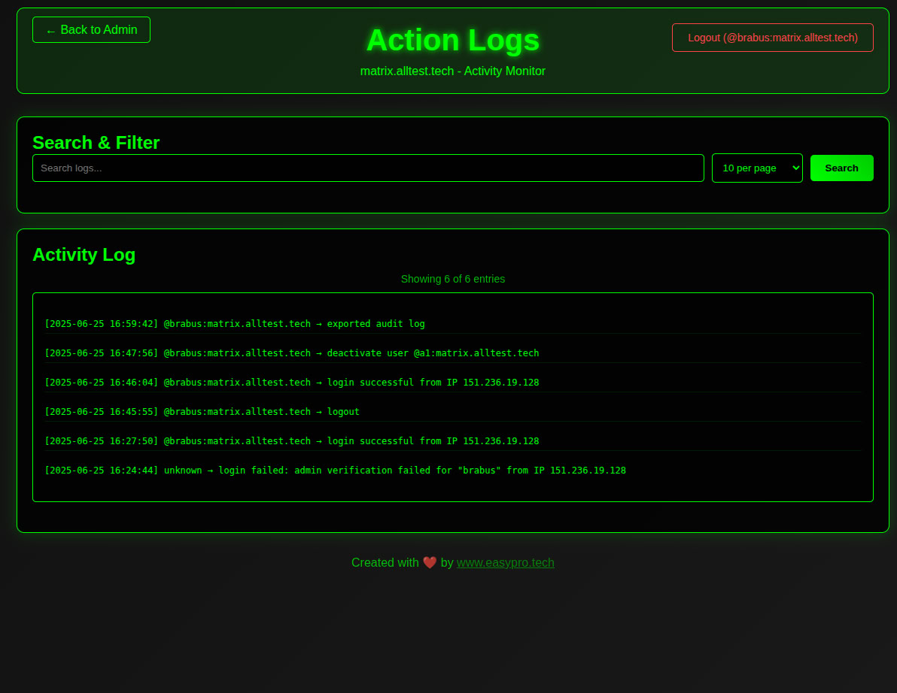
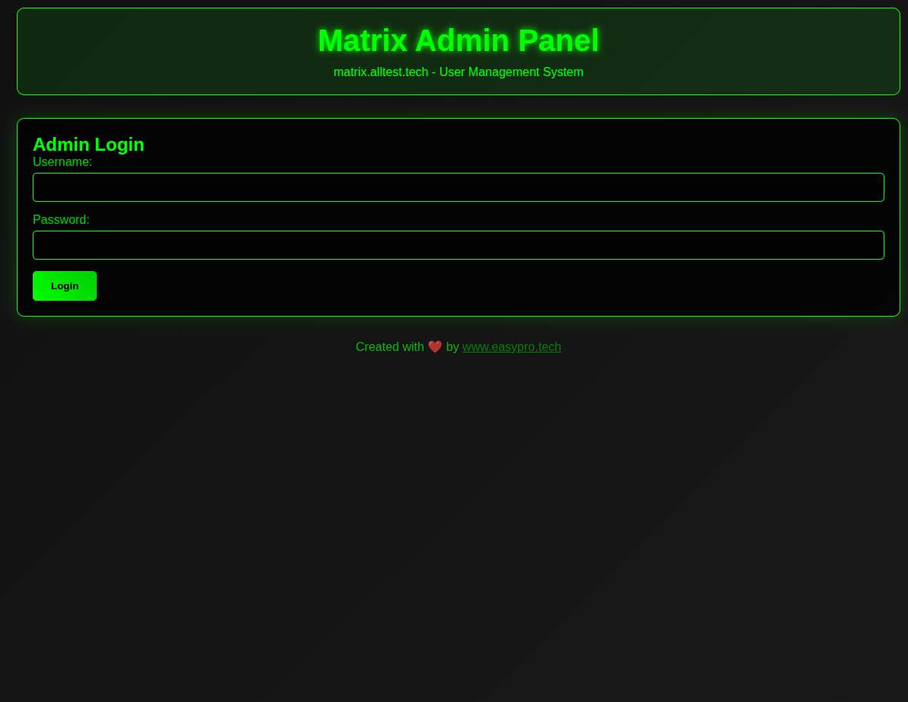

# 🔒 Paranoia Matrix Admin Panel v1.0

```
  ____                            _       
 |  _ \ __ _ _ __ __ _ _ __   ___ (_) __ _ 
 | |_) / _` | '__/ _` | '_ \ / _ \| |/ _` |
 |  __/ (_| | | | (_| | | | | (_) | | (_| |
 |_|   \__,_|_|  \__,_|_| |_|\___/|_|\__,_|
                                          
```

Олдскульная админка для Matrix Synapse, которая просто работает.

**Создано [EasyProTech LLC](https://www.easypro.tech) • Разработчик: Brabus**


Paranoia — это минималистичная админка для Matrix Synapse. Никаких фреймворков, никаких зависимостей, никакой ерунды. Чистый PHP, который работает.

## 📑 Содержание

- [🎯 Быстрый старт](#-быстрый-старт-2-минуты)
- [💡 Зачем Paranoia](#-зачем-paranoia)
- [✨ Возможности](#-возможности)
- [📸 Скриншоты](#-скриншоты)
- [🔧 Установка](#-установка)
- [⚙️ Конфигурация](#️-конфигурация)
- [🛡️ Безопасность](#️-безопасность)
- [🏗️ Архитектура](#️-архитектура)
- [📝 Лицензия](#-лицензия)
- [📞 Поддержка](#-поддержка)

## 🎯 Быстрый старт (2 минуты)

```bash
# Скачать
git clone https://github.com/EPTLLC/paranoia.matrix.git
cd paranoia.matrix

# Настроить
cp config.ini.example config.ini
# Отредактируйте config.ini с данными вашего Matrix сервера

# Развернуть (пример)
sudo ln -sf $(pwd)/* /var/www/paranoia-matrix/
sudo systemctl reload nginx
```

Откройте админку и войдите с учетными данными администратора Matrix.

## 💡 Зачем Paranoia

> *От автора – Brabus*

Инструменты администрирования Matrix слишком сложные. Фреймворки, зависимости, проблемы с CORS, сложная настройка.

Мне нужно было что-то, что:
- Работает сразу после установки
- Не имеет внешних зависимостей
- Можно проаудировать за 30 минут
- Не сломается после обновлений

Поэтому я создал Paranoia. Олдскульный PHP. Простой, безопасный, надежный.

## ✨ Возможности

### Основной функционал
- 👥 **Управление пользователями** - Создание, деактивация, реактивация пользователей
- 🔑 **Управление паролями** - Смена паролей пользователей
- 👑 **Права администратора** - Назначение/снятие прав администратора
- 📊 **Логирование активности** - Все действия записываются с экспортом в CSV
- 🗄️ **Автоархивирование** - Еженедельная ротация логов
- 🛡️ **Самозащита** - Предотвращение блокировки администратора

### Безопасность
- 🔐 **Авторизация через Matrix API** - Доступ только для администраторов Matrix
- 🛡️ **Защита от CSRF** - Токен-based безопасность
- ⏱️ **Ограничение попыток** - Защита от брутфорса
- 📝 **Аудиторский след** - Полное логирование действий
- 🚫 **Валидация ввода** - Все данные санитизируются

### Интерфейс
- 🎨 **Олдскульный дизайн** - Эстетика зеленого терминала
- 📱 **Мобильная версия** - Работает на всех устройствах
- 🔍 **Поиск пользователей** - Быстрый поиск пользователей
- 👻 **Фильтр деактивированных** - Показать/скрыть неактивных пользователей
- 📤 **Экспорт CSV** - Скачивание логов аудита

## 📸 Скриншоты

### Админ-панель

*Интерфейс управления пользователями с поиском и фильтрацией*

### Логи активности

*Полный аудиторский след с функцией экспорта*

### Главная страница

*Простая главная страница с информацией о проекте*

## 🔧 Установка

### Требования
- PHP 8.1+ с расширениями: curl, mbstring, fpm
- Веб-сервер Nginx
- Matrix Synapse с включенным Admin API
- SSL сертификат (рекомендуется)

### 1. Настройка системы
```bash
apt update
apt install -y nginx php8.1 php8.1-fpm php8.1-curl php8.1-mbstring certbot python3-certbot-nginx
systemctl enable nginx php8.1-fpm
systemctl start nginx php8.1-fpm
```

### 2. Скачивание и настройка
```bash
git clone https://github.com/EPTLLC/paranoia.matrix.git
cd paranoia.matrix
cp config.ini.example config.ini
```

### 3. Настройка веб-сервера
```bash
# Создание веб-директории
sudo mkdir -p /var/www/paranoia-matrix
sudo ln -sf $(pwd)/* /var/www/paranoia-matrix/

# Конфигурация Nginx
sudo tee /etc/nginx/sites-available/paranoia-matrix << 'EOF'
server {
    listen 80;
    server_name your-admin-domain.com;
    root /var/www/paranoia-matrix;
    index index.php;
    
    location ~ \.php$ {
        include snippets/fastcgi-php.conf;
        fastcgi_pass unix:/var/run/php/php8.1-fpm.sock;
        fastcgi_param SCRIPT_FILENAME $document_root$fastcgi_script_name;
        include fastcgi_params;
    }
    
    # Безопасность
    location ~ /\. { deny all; }
    location ~ /config\.ini { deny all; }
    location ~ /.*\.log { deny all; }
}
EOF

sudo ln -sf /etc/nginx/sites-available/paranoia-matrix /etc/nginx/sites-enabled/
sudo nginx -t && sudo systemctl reload nginx
```

### 4. SSL и права доступа
```bash
# SSL сертификат
sudo certbot --nginx -d your-admin-domain.com

# Установка прав
sudo chown -R www-data:www-data /var/www/paranoia-matrix
sudo mkdir -p /var/log/paranoia-matrix
sudo chown www-data:www-data /var/log/paranoia-matrix
```

## ⚙️ Конфигурация

Отредактируйте `config.ini`:

```ini
[matrix]
server = "https://your-matrix-server.com"
domain = "your-matrix-domain.com"

[security]
log_file = "/var/log/paranoia-matrix/admin-actions.log"
max_failed_attempts = 5
login_delay_microseconds = 300000
```

| Параметр | Описание |
|----------|----------|
| `server` | URL вашего Matrix сервера |
| `domain` | Домен Matrix сервера для ID пользователей |
| `log_file` | Путь к файлу логов активности |
| `max_failed_attempts` | Лимит попыток входа |
| `login_delay_microseconds` | Задержка после неудачного входа |

## 🛡️ Безопасность

### Принципы дизайна
- **Ноль зависимостей** - Никаких внешних библиотек для компрометации
- **Минимальный код** - Легко аудировать (< 1000 строк всего)
- **Прямой API** - Никаких прокси-слоев или усложнений
- **Файловая основа** - Простое логирование и конфигурация

### Механизмы защиты
- Аутентификация через Matrix API с проверкой прав администратора
- CSRF токены на всех формах
- Ограничение попыток с прогрессивными задержками
- Валидация и санитизация ввода
- Самозащита от блокировки администратора
- Автоматическое архивирование и ротация логов

## 🏗️ Архитектура

```
paranoia.matrix/
├── config.ini              # Конфигурация
├── index.php               # Главная страница
├── admin.php               # Основной интерфейс администратора
├── logs.php                # Просмотрщик логов
├── screens/                # Скриншоты
└── README.md               # Документация
```

### Интеграция с Matrix API
- `/_matrix/client/r0/login` - Аутентификация
- `/_synapse/admin/v1/users/@user:domain/admin` - Проверка прав администратора
- `/_synapse/admin/v2/users` - Список и управление пользователями
- `/_synapse/admin/v1/users/@user:domain/password` - Смена паролей

### Философия
Создано для администраторов, которые ценят:
- **Простоту** над сложностью
- **Безопасность** над функциями
- **Надежность** над трендами
- **Аудируемость** над абстракцией

## 📝 Лицензия

MIT License

Copyright (c) 2025 EasyProTech LLC  
Разработчик: Brabus

Данная лицензия разрешает лицам, получившим копию данного программного обеспечения и сопутствующей документации (в дальнейшем именуемыми «Программное обеспечение»), безвозмездно использовать Программное обеспечение без ограничений, включая неограниченное право на использование, копирование, изменение, слияние, публикацию, распространение, сублицензирование и/или продажу копий Программного обеспечения, а также лицам, которым предоставляется данное Программное обеспечение, при соблюдении следующих условий:

Указанное выше уведомление об авторском праве и данные условия должны быть включены во все копии или значимые части данного Программного обеспечения.

ДАННОЕ ПРОГРАММНОЕ ОБЕСПЕЧЕНИЕ ПРЕДОСТАВЛЯЕТСЯ «КАК ЕСТЬ», БЕЗ КАКИХ-ЛИБО ГАРАНТИЙ, ЯВНО ВЫРАЖЕННЫХ ИЛИ ПОДРАЗУМЕВАЕМЫХ, ВКЛЮЧАЯ ГАРАНТИИ ТОВАРНОЙ ПРИГОДНОСТИ, СООТВЕТСТВИЯ ПО ЕГО КОНКРЕТНОМУ НАЗНАЧЕНИЮ И ОТСУТСТВИЯ НАРУШЕНИЙ, НО НЕ ОГРАНИЧИВАЯСЬ ИМИ. НИ В КАКОМ СЛУЧАЕ АВТОРЫ ИЛИ ПРАВООБЛАДАТЕЛИ НЕ НЕСУТ ОТВЕТСТВЕННОСТИ ПО КАКИМ-ЛИБО ИСКАМ, ЗА УЩЕРБ ИЛИ ПО ИНЫМ ТРЕБОВАНИЯМ, В ТОМ ЧИСЛЕ, ПРИ ДЕЙСТВИИ КОНТРАКТА, ДЕЛИКТЕ ИЛИ ИНОЙ СИТУАЦИИ, ВОЗНИКШИМ ИЗ-ЗА ИСПОЛЬЗОВАНИЯ ПРОГРАММНОГО ОБЕСПЕЧЕНИЯ ИЛИ ИНЫХ ДЕЙСТВИЙ С ПРОГРАММНЫМ ОБЕСПЕЧЕНИЕМ.

--------------------------------------------------------------------------------

**ДОПОЛНИТЕЛЬНОЕ УВЕДОМЛЕНИЕ:**

Данное программное обеспечение предоставляется без какой-либо поддержки, обслуживания или гарантий.
Автор явно заявляет:

- НЕ БУДЕТ предоставляться поддержка (бесплатная или платная)
- НЕ БУДУТ предлагаться консультации
- НЕ БУДЕТ объяснений помимо существующей документации
- НЕТ ОБЯЗАТЕЛЬСТВ по исправлению ошибок или добавлению функций

Используйте это программное обеспечение на свой страх и риск. Используя это программное обеспечение, вы признаете и принимаете эти условия.

Вклады приветствуются, но будут рассматриваться по усмотрению автора без гарантированных сроков рассмотрения или принятия.

## 📞 Поддержка

Я **НЕ** предоставляю поддержку.  
Я **НЕ** консультирую — ни бесплатно, ни за деньги, ни в какой форме.

Пожалуйста, не просите помощи, исправлений или объяснений — этот проект выпущен как есть.

Если кто-то хочет помочь с разработкой — вклады приветствуются.  
Но с моей стороны **НЕТ НИКАКИХ ОБЯЗАТЕЛЬСТВ**.
